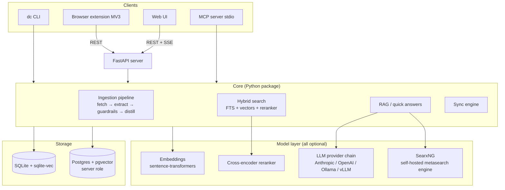
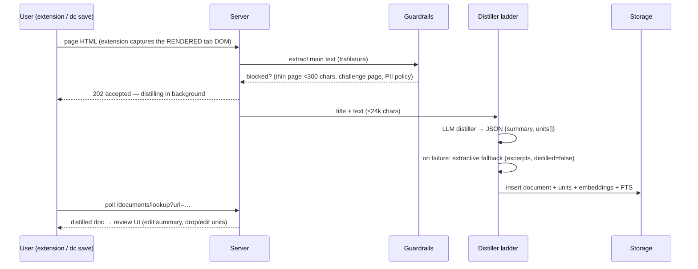
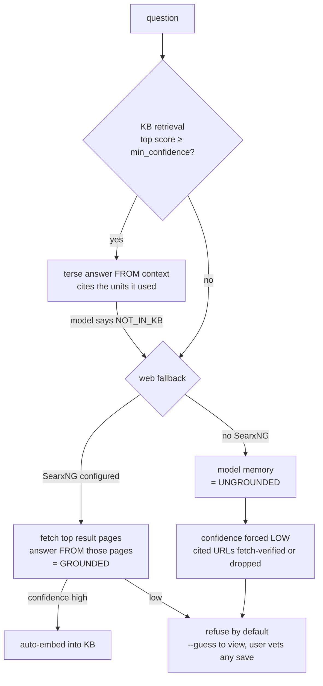

# DronaCharya — Architecture & Technical Guide

Personal knowledge management with a local RAG: save web pages and notes,
distill them into searchable **knowledge**, and answer questions with source
links — on your own machine, with LLMs you choose (or none at all).

This document explains how the system is built, how data flows through it,
and the reasoning behind the key design decisions.

---

## 1. Design principles

1. **Purely personal.** One user, one knowledge base. No accounts, no sharing,
   no collaboration features. Single-tenancy is enforced in code.
2. **Copyright-conscious by construction.** Only the single page you
   explicitly save is ever fetched — links are never crawled. Only *distilled
   knowledge* (your-words facts, concepts, how-tos) is stored, never the
   original page content. Every answer links back to its source.
3. **Offline-first.** Capture, search, and browsing work with no network and
   no LLM. Cloud providers and local model servers are accelerators, never
   dependencies.
4. **Trust is earned, not claimed.** Answers are labeled by provenance
   (your KB / the internet / model memory), confidence is computed rather
   than asserted, and unverifiable answers are refused by default.
5. **Permissive licensing.** Apache-2.0, and every Python dependency is
   permissively licensed. SearxNG (AGPL), the self-hosted metasearch
   engine behind grounded web answers, is only ever called over HTTP as a
   separate service you host — never a code dependency.

## 2. Component map



Repository layout:

```
dronacharya/
  cli.py            # `dc` — Typer CLI (ask is the default command)
  config.py         # pydantic config, ~/.dronacharya/config.toml
  ingest/           # fetch, extract (trafilatura), chunking, distill, pipeline
  guardrails/       # PII filter, thin-page/challenge-page detection
  llm/              # provider chain + prompts
  search.py         # hybrid retrieval (RRF fusion)
  reranker.py       # cross-encoder (auto-enabled on CUDA)
  rag.py            # streamed, cited answers; --deeper mode
  quick.py          # terse quick answers with web fallback + grounding
  storage/          # SqliteRepo / PostgresRepo behind one protocol
  sync/             # offline-first multi-device reconciliation
  server/           # FastAPI app + REST/SSE routes
  web/static/       # vanilla-JS web UI (chat, library, mind maps, tags, graph, to-dos)
  mindmap.py        # mind-map documents → knowledge units
  tagmap.py         # tag semantics, rename/delete, word-map layout data
  seed.py           # seed knowledge kits (build/install)
  importers/        # browser bookmark import
  mcp_server.py     # MCP stdio server
extension/          # MV3 browser extension (capture, review overlay, to-dos)
```

## 3. Data model

Everything is a **document** with **knowledge units**:

| Table | Purpose |
|---|---|
| `documents` | One row per source: web page, note file, mind map, to-do, quick-answer. Title, URL/file path, summary, `distilled` flag, distill tier, language, version, JSON `meta`. |
| `knowledge_units` | The actual knowledge: self-contained items with `kind` (`fact` / `concept` / `howto` / `excerpt` / `note`), text (≤ ~80 words), and a `heading_path` breadcrumb. |
| vectors | One embedding per unit (sqlite-vec virtual table, or pgvector). |
| FTS index | Full-text index over unit text (SQLite FTS5 / Postgres tsvector). |
| `tags` | Plain strings; `/` makes them hierarchical by convention only (`Research/RAG` is one tag — filtering by `Research` prefix-matches it). |
| `events` | Append-only audit log (saves, queries, errors). |
| sync ops | Versioned change-log consumed by the sync protocol. |

Documents are the unit of consent (save/overwrite/delete); knowledge units are
the unit of retrieval, embedding, and editing. Deleting a document removes all
its knowledge.

## 4. Capture & distillation flow



Key decisions:

- **The extension captures from the tab**, not by re-fetching the URL: pages
  behind logins and JS-rendered apps capture correctly, and the server never
  needs the user's cookies.
- **Distillation is a ladder**: the configured LLM chain first; if every
  provider fails, an extractive fallback stores heading-chunked excerpts so
  the save is still searchable and can be upgraded later (`dc redistill`, or
  the home server's upgrade pass during sync).
- The distillation prompt demands knowledge, not description: the summary must
  *teach* ("X is decided by A, B, C"), never say "this article explains…".
- **Re-saving a changed page requires consent** (HTTP 409 with old/new
  preview) unless the user opted into always-overwrite.
- Background failures are not silent: the last error per URL is surfaced to
  the polling client (HTTP 502) instead of an infinite spinner.

## 5. Retrieval: hybrid search + reranking

```
query ──► FTS5 keyword candidates ─┐
                                   ├─► RRF fusion (1/(60+rank)) ─► cross-encoder
query ──► vector candidates ───────┘        top ~30                rerank → top-k
(embedded locally)                                                 with logit scores
```

- **Embeddings are computed locally** (sentence-transformers; an English and a
  multilingual preset). Queries never leave the machine to be embedded.
- **Reciprocal-rank fusion** merges keyword and semantic candidates without
  score calibration headaches.
- The **cross-encoder reranker** defaults to `"on"` (small enough for CPU;
  `"auto"` restricts it to CUDA machines). Its scores are sigmoid-normalized
  probabilities in (0,1) — one calibrated scale on every machine — gated by
  `retrieval.min_relevance` (default 0.30, tuned against a golden evaluation
  set: ≥90% acceptance of covered questions, 100% refusal of off-corpus
  ones). Raw RRF scores (only when `rerank="off"`)
  are rank-based and cannot express "nothing matches"; they get their own
  threshold and honest documentation of that weakness.
- `dc search` refuses to show below-threshold garbage (say "No" instead);
  `--all` reveals weak matches.

## 6. Answering: the trust model

Two answer paths share one philosophy — *provenance is computed, labeled, and
gates what gets stored*.

### Quick answers (`dc "<question>"`)



- **"High confidence" exists only when grounded AND verified**: the model
  answered *from pages actually fetched* via your own SearxNG, the cited URL
  is one of them, and a claim-to-passage check (the reranker cross-encoder
  scoring answer-vs-page) confirms the cited page supports the claim. A bare
  model's self-reported confidence is always demoted — a reachable URL
  doesn't prove the model read it, and a fetched URL doesn't prove support.
- KB answers cite the context items used (`[n]`, stripped before display) so
  multi-part answers attribute **all** their sources, not just the top hit.
- Unverified answers print "No verified answer" with escape hatches
  (`--guess`, `dc query --deeper`) rather than serving plausible garbage.

### Chat answers (`dc query`, web UI)

RAG over retrieved units with inline `[n]` citations, streamed (SSE on the
server). `--deeper` deliberately steps outside the KB: clearly bannered,
retrieved units become *optional* context, and the sources list shows **only
what the answer actually cited** — an uncited retrieval candidate was context
the model rejected. Deeper answers are never auto-saved.

## 7. LLM provider layer

Providers implement one small protocol (`available()`, `complete()`,
`stream()`) and are tried in the user's configured order **per task**:
`get_provider_chain(config, task)` lets `[llm].distill_providers` pin small
local models to distillation, and the `[privacy]` per-task policy
(`local-only`) removes cloud providers from a task's chain entirely — silent
local→cloud fallthrough is structurally impossible, not just discouraged.
The base order:
`anthropic`, `openai`, `ollama`, `vllm` (the last two are one
OpenAI-compatible client pointed at different URLs).

Decoding policy (deliberate, not defaults):

- **Dense instruct models**: `temperature 0, seed 7` — extraction work wants
  greedy, reproducible decoding; it also curbs the language drift small models
  show at their default temperature.
- **Reasoning MoE models (gpt-oss family)**: `temperature 1.0` (greedy makes
  them loop) and `reasoning_effort: low` on extraction calls only —
  distillation doesn't need deep thinking, and this is what makes saves fast.
  Chat/`--deeper` keep full reasoning.
- **Model-id self-healing**: if the configured id 404s, the provider lists the
  server's models and resolves an unambiguous match (`gpt-oss-120b` →
  `openai/gpt-oss-120b`) or a single-model server automatically.
- The answer language is detected server-side and named explicitly in prompts
  ("Answer in English.") — "answer in the same language as the question" is
  too weak for small models and causes random-language answers.

## 8. What leaves your machine, and when

| Action | What is sent | To |
|---|---|---|
| Capture / save | Extracted page text (≤24k chars) for distillation | Your configured LLM provider only |
| `dc search`, library, tags, graph | Nothing | — |
| Embedding / reranking | Nothing (local models) | — |
| `dc "question"` / chat | Your question + the retrieved knowledge units | Your configured LLM provider |
| Web fallback with SearxNG | The question (as a search query); then plain HTTP fetches of result pages | Your own SearxNG instance; the result sites |
| Source verification | One HTTP fetch of a cited URL | The cited site |
| Sync | Documents/units/tags (your data) | Your own home server only |

There is no telemetry, no third-party service, and the browser extension talks
only to the server URL you configure.

## 9. Server, web UI, extension

- **FastAPI server** (`dc serve`, default `127.0.0.1:8317`): REST + SSE under
  `/api/v1` (self-documented at `/api/v1/docs`), bearer-token auth: the
  config token is the admin key, and `dc token create` mints scoped
  per-device tokens (read/write/admin, sha256-hashed, revocable). Startup
  beyond loopback is refused without a real token. Background distillation
  runs through a durable `jobs` table — queued work survives restarts and a
  crash-recovery pass finishes it. The
  same process serves standalone laptops and the Docker home-server role
  (Postgres + Ollama/vLLM containers; SearxNG behind a compose profile).
- **Web UI** (vanilla JS, no build step): chat with cited streaming answers,
  library with per-unit editing, full mind-map editor (layouts, themes, node
  styles, per-node rich-text notes, styled/labeled links, outline, exports —
  every node and note becomes searchable knowledge), semantic tags word map,
  knowledge graph, to-dos.
- **Extension** (Manifest V3, no content scripts until you act): captures the
  rendered DOM on explicit gesture only, shows an in-page overlay with
  distillation progress, then the distilled summary + knowledge units for
  review (edit/remove/discard) before they stay in the KB. Also to-do
  reminders via browser notifications. Host permissions are granted at
  runtime for exactly the server origin you configure.

## 10. Multi-device sync

Every device runs a complete offline KB. `dc sync` reconciles with a home
server through a versioned op log (opportunistically after saves when
`[sync] auto` is on):

- **Deletions always win** (a delete on any device removes everywhere).
- Concurrent edits resolve by the **per-document version counter** (a
  logical clock — immune to wall-clock skew), wall time only breaking
  version ties; the losing version is kept for review (`dc conflicts`).
- **Embeddings never travel**: ops carry text + metadata, each device
  re-embeds with its own model. A KB is bound to one embedding model via a
  stored fingerprint; changing models requires `dc reembed`.
- Saves distilled weakly offline (extractive tier) are **upgraded by the
  server's bigger model** on sync.
- Auto-sync runs opportunistically; everything works between syncs.

## 11. Guardrails

- **SSRF defense**: server-side fetches validate the target and every
  redirect hop (private/loopback/link-local/metadata blocked in server
  role; `[guardrails] allow_private_urls` policy), with bounded
  decompression. Request bodies and list parameters are capped.
- **Thin-page guard**: extractions under ~300 chars are rejected (login walls,
  cookie screens) rather than stored as junk.
- **Challenge-page detection**: CAPTCHA/anti-bot interstitials are recognized
  and refused.
- **PII filter** at ingest (`redact` / `block` / `off`).
- **Prompt-level honesty**: distillation must not reproduce pages verbatim;
  answers must cite; refusals are reserved for unanswerable questions, not
  legitimate topics (medicine, law, security are knowledge like any other).

## 12. Extensibility notes

- Storage is a repository protocol — SQLite and Postgres are the two shipped
  implementations.
- LLM providers are ~50-line classes; any OpenAI-compatible endpoint works
  out of the box via configuration alone.
- Seed kits are model-agnostic (no embeddings inside), so one kit installs
  into any embedding preset.
- The MCP server exposes `search_knowledge`, `get_document`, and `save_url`
  to any MCP client over stdio.
